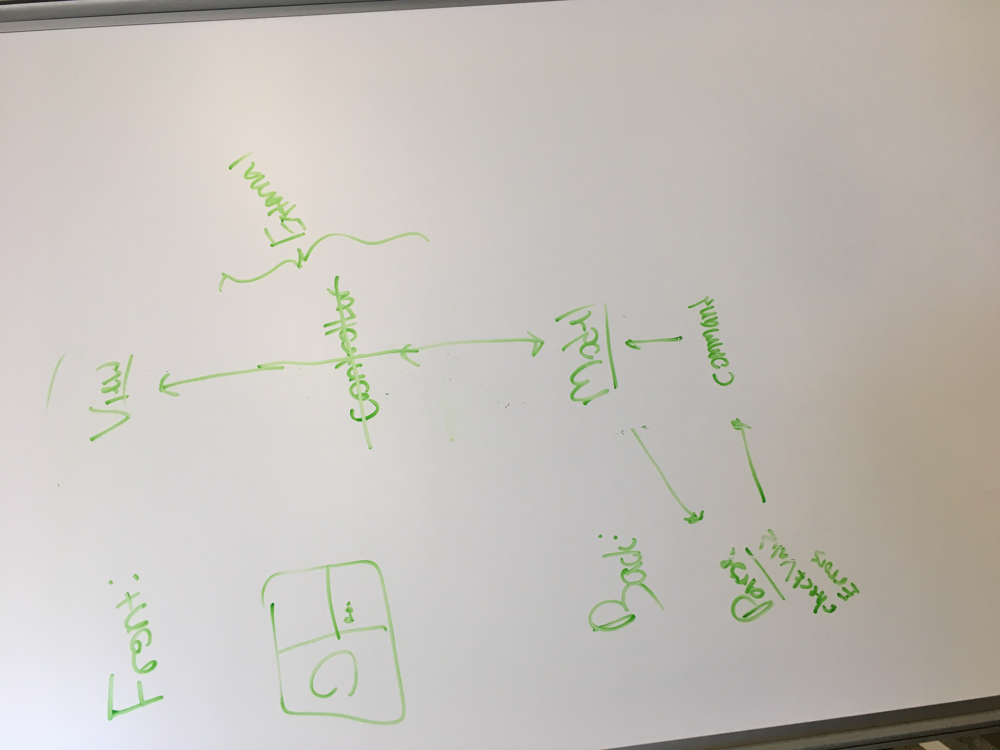

API Exercise
===============
Team Members
* Faith
* Gordon
* Henry
* Yanbo

API Critque
---------------
## **Configuration**

#### Internal
* Grid(int rows, int cols)
* fillGrid()
* setPoly(Unit u, int row, int col)
* Get
* public Grid(int rows, int cols)
* public void fillGrid()
* public abstract void setPoly(Unit u, int row, int col);
* public abstract Map<Integer[], Unit> getNeighbors(int row, int col);
* public Map<Integer[], Unit> getInstances(Unit U)
* public int rows()
* public int cols()
* public Unit getUnit(int row, int col)
* public void setUnit(int row, int col, Unit u)
* public List<Unit> getChildren()
* public List<List<Unit>> getGrid()
* public void setGrid(List<List<Unit>> newGrid)
* public void setNeighbors(List<Integer> list)
* public void makeToroidal()
* public void undoToroidal()
* public Map<Integer[], Unit> getFiniteNeighbors(int row, int col) 
* public Map<Integer[], Unit> getToroidalNeighbors(int row, int col) 

#### External
* getNeighbors(int row, int col)
* getInstances(Unit U)
* public Reads(String type, int is, int st)
* public Character get(int i, int j)
* public int size()
* public int height()
* public int width()
* public GridGenerator(int st, int us, int gs, int nc, int bs, int is, int w, int h)
* public Grid returnCurrGrid()
* public Grid returnNextGrid()
* public Grid returnInitialGrid()

## **Simulation**

#### Internal
* Alive
* Blank
* Burning
* Burnt
* Ant
* Food
* Ground
* Nest
* Predator
* Prey
* Agent
* Sugar
* Type1
* Type2
* Unit

#### External
* fireModel
* Model Class
* lifeModel
* segregationModel
* sugarModel
* watorModel

## **Simulation**

#### Internal
* public SceneSetup(int gridWidth, int gridHeight, ResourceBundle resourcesPackage, Stage stage) 
* public Button createSimButton(Pane root, String label) 
* public Text readFile(Pane infoRoot, String fileName) 
* public Button buttonPlay(Pane infoRoot, Scene nextScene, int simChoice) 
* public Button buttonBack(Pane infoRoot, Scene nextScene) 
* public Integer[] getChoices() 
* public void createButtons(Group root, Scene nextScene, String[] options) 
* public Label createLabel(Group root, int width, int height, String message) 
* public Button createSizeButton(Group sizeSceneRoot, String label)
* public VBox createBox(Group root, int width, int height) 

#### External
* public static Map<String, List<List<Character>>> returnMap() 
* public Model(Grid curr, Grid next, Grid init)
* public Group getRoot()
* public void reset() 
* public abstract void updateGrid();
* public void step()
* public abstract int getUnitA();
* public abstract int getUnitB();

SLogo Architecture Design
----------------------
1. Parsing takes place after a user types in characters and presses a button to confirm his input. This needs to occur before backend processes begin and it must start properly after pressing start. It will take place in the View class.
2. The result will be added to a RawCode object that will be passed down to Model.
3. Errors will be detected once Model passes the RawCode object to the ParseCode class. Here, the class will try to translate the RawCode to a Commands object, while doing so

Main (extend app)
Methods
start(Stage)
main(argc)
Responsibilities
Create stage
RunSimulation
Methods
step()
Responsibilities
Control animation of turtle

InputView
Methods
Responsibilities
View
Methods
setUpScene()
getLocationChange()
updateQueue(int[])
showError()
Responsibilities
Control user interface aspect of project
Receive position changes from command and display them
Major component of External API for frontend -- communicates with Model
Show the error message
Model
Methods
parseCommand(String) -- passes to parse
getLocationChange(int[])
Responsibilities
Major component of External API for backend -- communicates with View
Parse
Methods
checkValid()
readInput
Responsibilities 
Reads input
Interprets effect of imput
Command
Methods
setChange()
setBackground()
Responsibilities
History
Methods
addCommand(String)
Responsibilities
Keeps track of commands that have been called

Create Your API’s:
Internal Frontend: RunSimulation
External Frontend: View
Internal Backend: Parse, command, History
External Backend: Model

## Use Cases:
1. The user types 'fd 50' in the command window, sees the turtle move in the display window leaving a trail, and has the command added to the environment's history.
	InputView -> View -> Model -> Parse -> Command and History -> createCoordinates -> Model -> view -> RunSimulation

2. The user types '50 fd' in the command window and sees an error message that the command was not formatted correctly.
	InputView -> View -> Model -> Parse, checkValid() false ->  Model -> View showErro()

3. The user types 'pu fd 50 pd fd 50' in the command window and sees the turtle move twice (once without a trail and once with a trail).

	InputView -> View -> Model -> 
4.  The user changes the color of the environment's background.
	InputView -> View -> Model -> Parse, readInput() -> Command, setBackground() -> Model -> View -> RunSimulation

